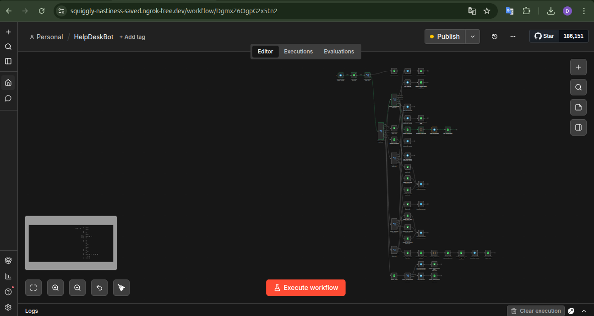

# 🤖 HelpDeskBot — Bot de Soporte Interno con n8n + Telegram

> Bot conversacional para gestión de solicitudes internas de soporte técnico, administrativo y consultas generales, construido sobre n8n Community Edition, Telegram y Google Sheets.

---

## 🚀 ¿Cómo lo pruebo?

### Requisitos previos

- Docker y Docker Compose instalados
- Una cuenta de Telegram y un bot creado via [@BotFather](https://t.me/BotFather)
- Una cuenta de Google con acceso a Google Sheets
- [ngrok](https://ngrok.com/) instalado (para exponer n8n al webhook de Telegram)

### Pasos

**1. Clona el repositorio**
```bash
git clone https://github.com/tu-usuario/helpdesk-bot.git
cd helpdesk-bot
```

**2. Levanta n8n con Docker**
```bash
docker compose up -d
```
n8n estará disponible en `http://localhost:5678`

**3. Expón el puerto con ngrok**
```bash
ngrok http 5678
```
Copia la URL pública generada (ej. `https://abc123.ngrok-free.app`)

**4. Configura las credenciales en n8n**
- Ve a **Credentials** en n8n
- Agrega tu token de Telegram Bot
- Agrega tu cuenta de Google Sheets (OAuth2)

**5. Importa el workflow**
- En n8n ve a **Workflows → Import**
- Carga el archivo `HelpDeskBot.json` incluido en el repositorio

**6. Configura Google Sheets**
- Descarga y usa la base de datos propuesta, cuenta con datos de prueba, los cuales puedes borrar si prefieres.
- Actualiza el ID del documento en los nodos de Google Sheets dentro del workflow

**7. Activa el workflow y prueba**
- Activa el workflow en n8n
- Abre Telegram, busca tu bot y envíale cualquier mensaje
- El bot responderá con el menú principal 👋

---

## 📋 La problemática

En muchos equipos de trabajo, las solicitudes de soporte interno se gestionan de forma desordenada: mensajes sueltos por WhatsApp, correos sin seguimiento, o simplemente conversaciones que se pierden. No existe un canal unificado, no hay registro histórico, y es difícil saber en qué estado está una solicitud una vez enviada.

El problema central es la falta de un sistema simple, accesible y sin fricción que permita a cualquier empleado abrir un ticket, consultarlo y saber que alguien lo atenderá, sin necesidad de instalar aplicaciones adicionales ni aprender herramientas complejas. Telegram ya está instalado en el celular de todos.

---

## 🗺️ Planeación y herramientas

El objetivo fue construir un sistema de help desk conversacional completamente funcional usando herramientas accesibles, de bajo costo y desplegables en cualquier servidor. La meta: que cualquier persona pudiera abrir un ticket desde Telegram en menos de un minuto, y que el equipo de soporte tuviera un registro organizado sin depender de software costoso.

### Herramientas utilizadas

| Herramienta | Rol en el proyecto |
|---|---|
| **n8n Community Edition** | Motor de lógica y automatización de flujos |
| **Telegram Bot API** | Interfaz conversacional con el usuario final |
| **Google Sheets** | Base de datos ligera (tickets, usuarios, logs) |
| **Docker** | Contenedor para desplegar n8n de forma reproducible |
| **Ubuntu Server** | Sistema operativo del servidor local |
| **ngrok** | Túnel para exponer el webhook de n8n durante desarrollo |

### Decisiones de diseño

La arquitectura se basa en un único trigger de Telegram que centraliza toda la lógica. El estado conversacional del usuario (en qué paso del wizard se encuentra) se persiste directamente en Google Sheets mediante el campo `pantalla_actual` de la tabla `USUARIOS`. Esto elimina la necesidad de una base de datos externa o memoria en sesión, haciendo el sistema stateless desde la perspectiva de n8n.

Los datos del wizard se codifican en `pantalla_actual`.

Se planificaron y cumplieron los siguientes flujos:
- ✅ Registro automático de usuarios nuevos
- ✅ Wizard guiado para creación de tickets (tipo → prioridad → descripción → confirmación)
- ✅ Consulta de estado por ID de ticket
- ✅ Listado de solicitudes propias
- ✅ Menú de ayuda
- ✅ Registro de logs por cada interacción
- ✅ Cancelación en cualquier punto del wizard

---

## 🔧 ¿Qué hice?

El workflow de n8n quedó compuesto por **45 nodos** organizados en rutas bien definidas:

**Flujo de entrada unificado**
Cada mensaje de Telegram dispara el mismo webhook. Lo primero que hace el bot es leer la fila del usuario en Google Sheets. Si no existe, lo registra automáticamente y muestra el menú de bienvenida. Si ya existe, consulta su `pantalla_actual` y enruta la ejecución al punto correcto del flujo.

**Máquina de estados con `pantalla_actual`**
El campo `pantalla_actual` en la hoja `USUARIOS` funciona como el estado del usuario. Toma valores como `MENU_PRINCIPAL`, `CREANDO_TICKET_TIPO`, `CREANDO_TICKET_PRIORIDAD|Soporte técnico`, etc. El nodo `Switch_Pantallas` lee este valor al inicio de cada ejecución y decide a qué rama enviar el mensaje entrante.

**Wizard de creación de tickets**
El flujo guiado recorre 5 pasos conversacionales, actualizando `pantalla_actual` en cada uno y acumulando los datos del ticket en el mismo campo. Al confirmar, un nodo de código genera el ID del ticket (`TKT-0000`) y escribe la fila completa en la hoja `SOLICITUDES`.

**Consulta y listado**
La opción 2 permite buscar un ticket por ID directamente en la hoja de SOLICITUDES. La opción 3 filtra todos los tickets del usuario por su `telegram_user` y los formatea en un mensaje legible con estado e íconos de color.

**Registro de logs**
Cada acción relevante escribe una fila en la hoja `LOGS` con timestamp, usuario, pantalla, opción elegida y resultado, dejando trazabilidad completa de todo lo que ocurre en el bot.

### 📸 Evidencia del flujo en n8n

La siguiente captura muestra el workflow completo importado y activo en n8n, accedido a través del túnel ngrok desde Ubuntu:



> El flujo corre sobre n8n Community Edition en un contenedor Docker, expuesto públicamente mediante ngrok en Ubuntu. Se pueden observar los 45 nodos distribuidos en las distintas rutas: registro de usuario, menú principal, wizard de creación de tickets, consulta de estado, mis solicitudes y sistema de logs.

---

##  Conclusión

HelpDeskBot demuestra que es posible construir un sistema de soporte interno completamente funcional sin infraestructura compleja ni licencias costosas. Usando n8n como orquestador, Telegram como canal de comunicación y Google Sheets como persistencia, se logra una solución que cualquier equipo pequeño o mediano puede adoptar, personalizar y mantener con conocimientos básicos.

El mayor aprendizaje del proyecto fue entender cómo manejar estado conversacional en un entorno stateless: codificar el progreso del wizard directamente en la base de datos resultó ser una solución simple, efectiva y fácil de depurar. Cada ejecución del workflow es independiente y autosuficiente.

El proyecto es una base sólida sobre la cual pueden construirse mejoras como notificaciones al equipo de soporte, cambios de estado de tickets, o integración con herramientas como Slack o correo electrónico.

---

##  Agradecimientos

Al profesor y compañeros del curso por el acompañamiento durante el proceso de aprendizaje y por las discusiones que ayudaron a definir mejor el alcance del proyecto.

A la comunidad de **n8n** por la documentación y los ejemplos que facilitaron entender el modelo de ejecución de los workflows.


Y a todos los que probaron el bot durante el desarrollo y reportaron comportamientos inesperados — sin eso, varios bugs habrían pasado desapercibidos.

---

*Proyecto desarrollado como parte de un ejercicio académico de automatización con herramientas no-code/low-code.*